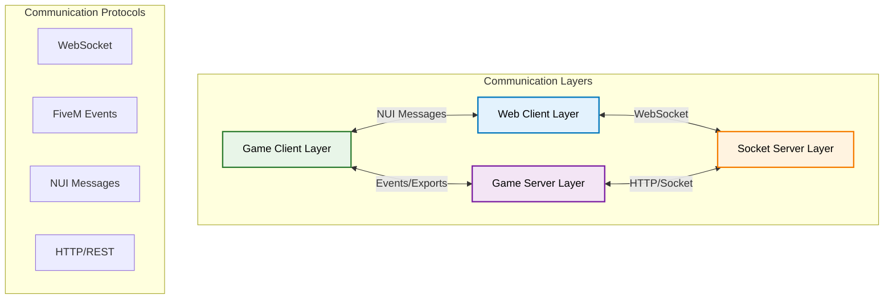
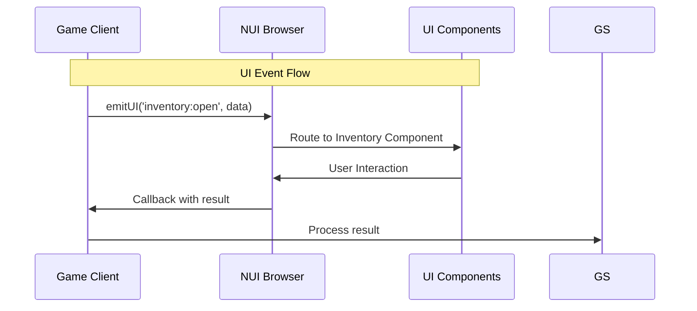

# Communication Flow Architecture

Pioneer Village implements a sophisticated multi-layer communication system that enables seamless interaction between game clients, servers, web clients, and external services. This document details how communication flows through the system.

## Overview

The communication architecture consists of four primary layers, each with specific responsibilities and communication patterns:



## Communication Patterns

### 1. Game Client ↔ Game Server Communication

The primary game communication uses FiveM's native event system with TypeScript wrappers.

#### Client to Server Events

```typescript
// lib/client/comms/server.ts implementation
export const emitServer = (event: string, ...args: any[]) => {
  TriggerServerEvent(event, ...args);
};

// Usage in resources
emitServer('player:updatePosition', { x: 100, y: 200, z: 30 });
emitServer('inventory:useItem', itemId, slot);
emitServer('job:acceptOffer', jobId, playerId);
```

#### Server to Client Events

```typescript
// lib/server/comms/client.ts implementation  
export const emitNet = (event: string, target: number | number[], ...args: any[]) => {
  if (Array.isArray(target)) {
    target.forEach(t => TriggerClientEvent(event, t, ...args));
  } else {
    TriggerClientEvent(event, target, ...args);
  }
};

// Usage in resources
emitNet('player:healthUpdate', source, { health: 100, stamina: 75 });
emitNet('inventory:updateSlot', source, slot, item);
TriggerClientEvent('world:weather', -1, 'sunny'); // Broadcast to all
```

#### Event Handling Pattern

```typescript
// Client-side event registration
onNet('player:healthUpdate', (data: { health: number; stamina: number }) => {
  updatePlayerHealth(data.health);
  updatePlayerStamina(data.stamina);
});

// Server-side event registration
onNet('player:updatePosition', (position: Vector3) => {
  const source = global.source;
  updatePlayerPosition(source, position);
});
```

### 2. Game Client ↔ UI Communication

The UI system uses NUI (Native UI) for browser-based interfaces with a sophisticated ClientRPC.Server system.

#### UI Communication Architecture



#### UI Event System

Located in `resources/ui/src/client/client.ts`:

```typescript
// Event listeners for different types of UI communication
const eventListeners: Map<string, Set<(...args: any[]) => void>> = new Map();
const callListeners: Map<string, (...args: any[]) => any> = new Map();
const pendingCallbacks: Map<string, PendingCallback> = new Map();

// Send event to UI
export const emitUI = (event: string, ...args: any[]) => {
  SendNuiMessage(JSON.stringify({
    type: 'event',
    event,
    args
  }));
};

// Register UI event listener
export const onUI = (event: string, callback: (...args: any[]) => void) => {
  if (!eventListeners.has(event)) {
    eventListeners.set(event, new Set());
  }
  eventListeners.get(event)!.add(callback);
};

// ClientRPC.Server-style UI call with response
export const awaitUI = <T = any>(event: string, ...args: any[]): Promise<T> => {
  return new Promise((resolve, reject) => {
    const id = generateCallId();
    const timeout = setTimeout(() => {
      pendingCallbacks.delete(id);
      reject(new Error(`UI call timeout: ${event}`));
    }, 10000);

    pendingCallbacks.set(id, { resolve, reject, timeout });
    
    SendNuiMessage(JSON.stringify({
      type: 'call',
      id,
      event,
      args
    }));
  });
};
```

#### Focus Management

```typescript
// UI focus control
export const focusUI = (focus: boolean, keepCursor: boolean = false) => {
  SetNuiFocus(focus, keepCursor);
  if (focus) {
    createResourceTick();
  }
};

// Layer-based focus system
const focusLayer = (layer: string, focus: boolean) => {
  emitUI('system:focus', { layer, focus });
  focusUI(focus);
};
```

### 3. Game Server ↔ Socket Server Communication

The socket server provides web API and real-time communication capabilities.

#### Socket Event System

Located in `lib/server/comms/socket.ts`:

```typescript
import io from 'socket.io-client';

let socket: ReturnType<typeof io> | null = null;

// Initialize socket connection
export const initializeSocket = () => {
  socket = io('http://localhost:3001/server', {
    auth: {
      serverKey: process.env.SERVER_KEY
    }
  });
  
  socket.on('connect', () => {
    console.log('Connected to socket server');
  });
};

// Emit events to socket server
export const emitSocket = (event: string, ...args: any[]) => {
  if (socket?.connected) {
    socket.emit(event, ...args);
  }
};

// Listen for socket events
export const onSocket = (event: string, callback: (...args: any[]) => void) => {
  socket?.on(event, callback);
};
```

#### HTTP API Integration

```typescript
// RESTful API calls to socket server
export const apiRequest = async (endpoint: string, options: RequestInit = {}) => {
  const response = await fetch(`http://localhost:3001/api${endpoint}`, {
    headers: {
      'Content-Type': 'application/json',
      'Authorization': `Bearer ${process.env.API_TOKEN}`,
      ...options.headers
    },
    ...options
  });
  
  return response.json();
};
```

### 4. Web Client ↔ Socket Server Communication

Web clients connect via WebSocket for real-time administration and monitoring.

#### WebSocket Connection

```javascript
// Web client connection example
const socket = io('http://localhost:3001/admin', {
  auth: {
    token: localStorage.getItem('adminToken')
  }
});

// Real-time player updates
socket.on('admin:playerUpdate', (playerData) => {
  updatePlayerDisplay(playerData);
});

// Send admin commands
socket.emit('admin:kickPlayer', { playerId: 123, reason: 'Violation' });
```

## Event Naming Conventions

Pioneer Village uses a structured event naming system for organization and debugging:

### Naming Pattern
```
resource:action[:target][:modifier]
```

### Examples
```typescript
// Player events
'player:connect'           // Player connects
'player:disconnect'        // Player disconnects  
'player:update:health'     // Player health update
'player:update:position'   // Player position update

// Inventory events
'inventory:open'           // Open inventory UI
'inventory:close'          // Close inventory UI
'inventory:useItem'        // Use an item
'inventory:updateSlot'     // Update inventory slot

// Job events  
'job:start'               // Start a job
'job:complete'            // Complete a job
'job:update:progress'     // Update job progress

// Admin events
'admin:player:kick'       // Admin kicks player
'admin:server:restart'    // Admin restarts server
'admin:monitor:status'    // Monitor server status
```

## Resource Communication Patterns

### Export System

Resources expose functionality through the export system for inter-resource communication:

```typescript
// Exporting functions (in base resource)
global.exports('getPlayerData', (source: number) => {
  return players.get(source);
});

global.exports('updatePlayerHealth', (source: number, health: number) => {
  const player = players.get(source);
  if (player) {
    player.health = health;
    emitNet('player:healthUpdate', source, { health });
  }
});

// Using exports (in other resources)
const playerData = global.exports.base.getPlayerData(source);
global.exports.base.updatePlayerHealth(source, 100);
```

### Event Forwarding

Resources can forward events between layers:

```typescript
// Server resource forwarding client event to socket server
onNet('player:locationUpdate', (location: Vector3) => {
  const source = global.source;
  const playerData = getPlayerData(source);
  
  // Update local state
  updatePlayerLocation(source, location);
  
  // Forward to socket server for web clients
  emitSocket('player:update', {
    id: source,
    name: playerData.name,
    location: location
  });
});
```

## Error Handling and Resilience

### Connection Recovery

```typescript
// Socket reconnection logic
socket.on('disconnect', () => {
  console.log('Socket disconnected, attempting reconnection...');
  setTimeout(() => {
    socket.connect();
  }, 5000);
});

// Event queuing during disconnection
const eventQueue: Array<{ event: string; args: any[] }> = [];

export const emitSocketReliable = (event: string, ...args: any[]) => {
  if (socket?.connected) {
    socket.emit(event, ...args);
  } else {
    eventQueue.push({ event, args });
  }
};

socket.on('connect', () => {
  // Flush queued events
  while (eventQueue.length > 0) {
    const { event, args } = eventQueue.shift()!;
    socket.emit(event, ...args);
  }
});
```

### Timeout Handling

```typescript
// UI call timeouts
const UI_CALL_TIMEOUT = 10000; // 10 seconds

export const awaitUI = <T>(event: string, ...args: any[]): Promise<T> => {
  return new Promise((resolve, reject) => {
    const timeout = setTimeout(() => {
      reject(new Error(`UI call timeout: ${event}`));
    }, UI_CALL_TIMEOUT);
    
    // ... rest of implementation
  });
};
```

### Event Validation

```typescript
// Type-safe event handling
interface EventHandlers {
  'player:update': (data: PlayerData) => void;
  'inventory:useItem': (itemId: string, slot: number) => void;
  'job:complete': (jobId: string, result: JobResult) => void;
}

export const onNetTyped = <K extends keyof EventHandlers>(
  event: K,
  handler: EventHandlers[K]
) => {
  onNet(event, handler);
};
```

## Performance Considerations

### Event Batching

```typescript
// Batch frequent updates
const pendingUpdates = new Map<number, Partial<PlayerData>>();

export const batchPlayerUpdate = (source: number, update: Partial<PlayerData>) => {
  const existing = pendingUpdates.get(source) || {};
  pendingUpdates.set(source, { ...existing, ...update });
};

// Flush batched updates every 100ms
setInterval(() => {
  for (const [source, update] of pendingUpdates) {
    emitNet('player:batchUpdate', source, update);
  }
  pendingUpdates.clear();
}, 100);
```

### Rate Limiting

```typescript
// Rate limit player events
const playerEventCounts = new Map<number, number>();

export const rateLimitedEmit = (source: number, event: string, ...args: any[]) => {
  const count = playerEventCounts.get(source) || 0;
  
  if (count > 100) { // Max 100 events per minute
    console.warn(`Rate limit exceeded for player ${source}`);
    return;
  }
  
  playerEventCounts.set(source, count + 1);
  emitNet(event, source, ...args);
};

// Reset counters every minute
setInterval(() => {
  playerEventCounts.clear();
}, 60000);
```

## Debugging Communication

### Event Logging

```typescript
// Debug event logging
const DEBUG_EVENTS = process.env.DEBUG_EVENTS === 'true';

const originalEmitServer = emitServer;
export const emitServer = (event: string, ...args: any[]) => {
  if (DEBUG_EVENTS) {
    console.log(`[CLIENT->SERVER] ${event}`, args);
  }
  return originalEmitServer(event, ...args);
};

const originalEmitNet = emitNet;
export const emitNet = (event: string, target: number, ...args: any[]) => {
  if (DEBUG_EVENTS) {
    console.log(`[SERVER->CLIENT] ${event} (target: ${target})`, args);
  }
  return originalEmitNet(event, target, ...args);
};
```

### Communication Monitoring

```typescript
// Monitor communication health
interface CommunicationStats {
  eventsPerSecond: number;
  averageLatency: number;
  errorRate: number;
}

export const getCommunicationStats = (): CommunicationStats => {
  // Implementation for gathering communication metrics
  return {
    eventsPerSecond: eventCounter / 60,
    averageLatency: totalLatency / eventCount,
    errorRate: errorCount / eventCount
  };
};
```

## Next Steps

- **[Resource System](resource-system.md)** - How resources interact and manage dependencies
- **[Type System](type-system.md)** - TypeScript patterns for type-safe communication
- **[Socket Architecture](socket-architecture.md)** - Deep dive into the Socket.IO implementation

---

*Understanding communication flow is essential for building responsive and reliable resources in Pioneer Village.*
