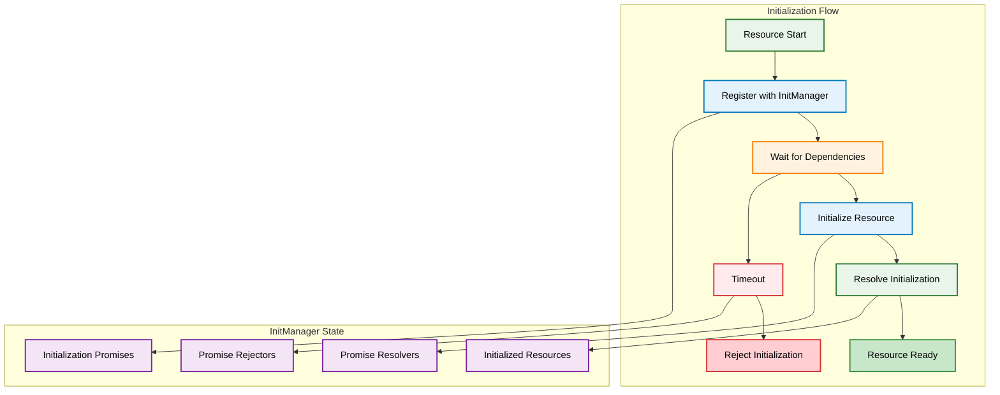

# Initialization System

Pioneer Village implements a sophisticated initialization system that manages resource startup order, dependency resolution, and cross-resource coordination. This system ensures resources start in the correct order and can safely depend on each other.

## Architecture Overview

The initialization system is built around the `InitManager` class in `resources/[core]/init/`, which provides:

- **Dependency Management** - Ensures resources start in correct order
- **Promise-based Coordination** - Resources can wait for dependencies
- **Timeout Handling** - Prevents deadlocks with configurable timeouts
- **Event Integration** - Responds to FiveM resource lifecycle events



## InitManager Implementation

### Core Architecture

Located in `resources/[core]/init/src/client/managers/init-manager.ts`:

```typescript
class InitManager {
  protected static instance: InitManager;
  
  // Singleton pattern
  static getInstance(): InitManager {
    if (!InitManager.instance) {
      InitManager.instance = new InitManager();
    }
    return InitManager.instance;
  }

  // State management
  protected _resourcePrefix = 'resource::';
  protected _initializedResources: Set<string> = new Set();
  protected _initializedResolver: Map<string, () => void> = new Map();
  protected _initializedRejector: Map<string, () => void> = new Map();
  protected _initialized: Map<string, Promise<void>> = new Map();
}
```

### Registration System

```typescript
register: Init.register = (name, options = {}) => {
  // Handle reset option for resource restarts
  if (options.reset && this._initialized.has(name)) {
    this.reject(name);
    this._initialized.delete(name);
    this._initializedResolver.delete(name);
    this._initializedRejector.delete(name);
  }

  if (!this._initialized.has(name)) {
    // Create initialization promise
    const promise = new Promise<void>((resolve, reject) => {
      this._initializedResolver.set(name, resolve);
      this._initializedRejector.set(name, reject);
    });

    // Error handling
    promise.catch(() => {
      Log('Initialization failed:', name);
    });

    this._initialized.set(name, promise);

    // Optional auto-resolution after timeout
    if (typeof options.resolveAfter === 'number') {
      setTimeout(() => {
        this.resolve(name);
      }, options.resolveAfter);
    }

    // Optional auto-rejection after timeout
    if (typeof options.rejectAfter === 'number') {
      setTimeout(() => {
        this.reject(name);
      }, options.rejectAfter);
    }
  }
};
```

### Resource Lifecycle Management

```typescript
constructor() {
  // Register all existing resources at startup
  const numResources = GetNumResources();
  for (let n = numResources; n--; ) {
    const resourceName = GetResourceByFindIndex(n);
    if (resourceName) {
      this.registerResource(resourceName);
    }
  }

  // Export initialization status for other resources
  exports('initialized', () => {
    return this.resourceInitialized;
  });

  // Handle dynamic resource events
  on('onResourceStart', (resourceName: string) => {
    Log('Resource starting:', resourceName);
    this.registerResource(resourceName);
  });

  on('onResourceStop', (resourceName: string) => {
    const resourceKey = `${this._resourcePrefix}${resourceName}`;
    if (!this._initializedResources.has(resourceKey)) {
      Log('Resource stopping before initialization:', resourceName);
      this.rejectResource(resourceName);
      this.registerResource(resourceName, { reset: true });
    }
  });
}
```

## Usage Patterns

### Basic Resource Registration

```typescript
// In any resource's client.ts
import { initManager } from '@lib/client';

// Register this resource for initialization tracking
initManager.registerResource(GetCurrentResourceName());

// Wait for another resource to initialize
const waitForBase = async () => {
  try {
    await initManager.initializedResource('base');
    console.log('Base resource is ready!');
  } catch (error) {
    console.error('Base resource failed to initialize:', error);
  }
};
```

### Dependency Chain Example

```typescript
// In a resource that depends on multiple others
import { initManager } from '@lib/client';

const initializeWithDependencies = async () => {
  try {
    // Wait for core dependencies
    await Promise.all([
      initManager.initializedResource('base'),
      initManager.initializedResource('ui'),
      initManager.initializedResource('events')
    ]);

    console.log('All dependencies ready, initializing...');
    
    // Perform initialization that requires dependencies
    setupEventHandlers();
    registerUIComponents();
    initializeGameLogic();

    // Mark this resource as initialized
    initManager.resolveResource(GetCurrentResourceName());
    
  } catch (error) {
    console.error('Dependency initialization failed:', error);
    initManager.rejectResource(GetCurrentResourceName());
  }
};

initializeWithDependencies();
```

### Timeout-based Initialization

```typescript
// Register with automatic timeout
initManager.register('my-critical-resource', {
  resolveAfter: 5000,  // Auto-resolve after 5 seconds
  rejectAfter: 10000   // Auto-reject after 10 seconds if not resolved
});

// Or handle timeout manually
const initWithTimeout = async () => {
  const resourceName = GetCurrentResourceName();
  
  // Register for initialization
  initManager.registerResource(resourceName);
  
  try {
    // Race between initialization and timeout
    await Promise.race([
      performInitialization(),
      new Promise((_, reject) => 
        setTimeout(() => reject(new Error('Initialization timeout')), 8000)
      )
    ]);
    
    initManager.resolveResource(resourceName);
  } catch (error) {
    console.error('Initialization failed:', error);
    initManager.rejectResource(resourceName);
  }
};
```

## Advanced Initialization Patterns

### Conditional Initialization

```typescript
// Initialize based on server configuration
const conditionalInit = async () => {
  const config = await global.exports.base.getServerConfig();
  
  if (config.enableAdvancedFeatures) {
    await initManager.initializedResource('advanced-systems');
    setupAdvancedFeatures();
  }
  
  if (config.enableDebugMode) {
    await initManager.initializedResource('debug-tools');
    setupDebugTools();
  }
  
  initManager.resolveResource(GetCurrentResourceName());
};
```

### Retry Logic

```typescript
// Initialization with retry logic
const initWithRetry = async (maxRetries = 3) => {
  const resourceName = GetCurrentResourceName();
  
  for (let attempt = 1; attempt <= maxRetries; attempt++) {
    try {
      console.log(`Initialization attempt ${attempt}/${maxRetries}`);
      
      await performInitialization();
      initManager.resolveResource(resourceName);
      return;
      
    } catch (error) {
      console.error(`Attempt ${attempt} failed:`, error);
      
      if (attempt === maxRetries) {
        initManager.rejectResource(resourceName);
        throw new Error(`Initialization failed after ${maxRetries} attempts`);
      }
      
      // Wait before retry
      await new Promise(resolve => setTimeout(resolve, 1000 * attempt));
    }
  }
};
```

### Progressive Initialization

```typescript
// Initialize in stages with progress reporting
const progressiveInit = async () => {
  const resourceName = GetCurrentResourceName();
  const stages = [
    { name: 'Core Systems', fn: initCoreSystems },
    { name: 'Event Handlers', fn: setupEventHandlers },
    { name: 'UI Components', fn: initUIComponents },
    { name: 'Game Logic', fn: initGameLogic }
  ];
  
  try {
    for (let i = 0; i < stages.length; i++) {
      const stage = stages[i];
      console.log(`[${resourceName}] Initializing ${stage.name} (${i + 1}/${stages.length})`);
      
      await stage.fn();
      
      // Report progress to monitoring systems
      global.exports.base.reportInitProgress(resourceName, {
        stage: stage.name,
        progress: (i + 1) / stages.length
      });
    }
    
    initManager.resolveResource(resourceName);
    console.log(`[${resourceName}] Initialization complete!`);
    
  } catch (error) {
    console.error(`[${resourceName}] Initialization failed at stage:`, error);
    initManager.rejectResource(resourceName);
  }
};
```

## Integration with Resource System

### Resource Dependencies

Resources can declare dependencies in their manifest or initialization:

```typescript
// In resource initialization
const dependencies = [
  'base',      // Core functionality
  'ui',        // UI system
  'events',    // Event management
  'database'   // Database access
];

const initWithDependencies = async () => {
  console.log('Waiting for dependencies:', dependencies);
  
  // Wait for all dependencies
  await Promise.all(
    dependencies.map(dep => initManager.initializedResource(dep))
  );
  
  console.log('All dependencies satisfied, initializing...');
  // ... perform initialization
};
```

### Export Integration

The initialization system integrates with the export system:

```typescript
// Other resources can check initialization status
const isResourceReady = (resourceName: string): boolean => {
  return global.exports.init?.isResourceInitialized?.(resourceName) || false;
};

// Wait for resource availability
const waitForResource = async (resourceName: string): Promise<void> => {
  if (isResourceReady(resourceName)) {
    return;
  }
  
  return initManager.initializedResource(resourceName);
};
```

## Error Handling and Debugging

### Initialization Monitoring

```typescript
// Monitor initialization status
const monitorInitialization = () => {
  const checkInterval = setInterval(() => {
    const pending = Array.from(initManager._initialized.entries())
      .filter(([, promise]) => promise.isPending())
      .map(([name]) => name);
    
    if (pending.length > 0) {
      console.log('Pending initializations:', pending);
    } else {
      console.log('All resources initialized');
      clearInterval(checkInterval);
    }
  }, 5000);
};
```

### Deadlock Detection

```typescript
// Detect potential deadlocks
const detectDeadlocks = () => {
  const pendingResources = new Set<string>();
  
  setInterval(() => {
    const currentPending = new Set(
      Array.from(initManager._initialized.entries())
        .filter(([, promise]) => promise.isPending())
        .map(([name]) => name)
    );
    
    // Check if same resources are pending for too long
    if (setsEqual(pendingResources, currentPending) && currentPending.size > 0) {
      console.warn('Potential deadlock detected:', Array.from(currentPending));
    }
    
    pendingResources.clear();
    currentPending.forEach(name => pendingResources.add(name));
  }, 30000); // Check every 30 seconds
};
```

### Initialization Diagnostics

```typescript
// Comprehensive initialization diagnostics
export const getInitializationDiagnostics = () => {
  return {
    totalResources: initManager._initialized.size,
    initializedResources: initManager._initializedResources.size,
    pendingResources: Array.from(initManager._initialized.entries())
      .filter(([, promise]) => promise.isPending())
      .map(([name]) => name),
    failedResources: Array.from(initManager._initialized.entries())
      .filter(([, promise]) => promise.isRejected())
      .map(([name]) => name),
    initializationTime: Date.now() - startTime
  };
};
```

## Performance Considerations

### Lazy Initialization

```typescript
// Defer non-critical initialization
const lazyInit = async () => {
  // Initialize critical components first
  await initCriticalSystems();
  initManager.resolveResource(GetCurrentResourceName());
  
  // Initialize non-critical components in background
  setTimeout(async () => {
    await initNonCriticalSystems();
    console.log('Background initialization complete');
  }, 1000);
};
```

### Parallel Initialization

```typescript
// Initialize independent systems in parallel
const parallelInit = async () => {
  // These can run in parallel
  await Promise.all([
    initUISystem(),
    initAudioSystem(),
    initInputSystem()
  ]);
  
  // These require the above to be complete
  await initGameLogic();
  
  initManager.resolveResource(GetCurrentResourceName());
};
```

## Best Practices

### 1. **Always Register Resources**
```typescript
// Every resource should register itself
initManager.registerResource(GetCurrentResourceName());
```

### 2. **Handle Initialization Errors**
```typescript
try {
  await performInitialization();
  initManager.resolveResource(resourceName);
} catch (error) {
  console.error('Initialization failed:', error);
  initManager.rejectResource(resourceName);
}
```

### 3. **Use Meaningful Timeouts**
```typescript
// Set reasonable timeouts based on complexity
initManager.register(resourceName, {
  rejectAfter: 15000 // 15 seconds for complex resources
});
```

### 4. **Provide Progress Feedback**
```typescript
console.log(`[${resourceName}] Starting initialization...`);
console.log(`[${resourceName}] Waiting for dependencies...`);
console.log(`[${resourceName}] Initialization complete!`);
```

## Integration Examples

See the initialization system in action:

- **[Base Resource](../examples/basic-resource/)** - Basic initialization pattern
- **[UI Integration](../examples/ui-integration/)** - UI-dependent resource initialization
- **[Database Usage](../examples/database-usage/)** - Database-dependent initialization

## Next Steps

- **[UI System](ui-system.md)** - How UI resources integrate with initialization
- **[Player Management](player-management.md)** - Player session initialization
- **[Events System](events-system.md)** - Event system initialization patterns

---

*The initialization system is the foundation that ensures all Pioneer Village resources start reliably and in the correct order.*
