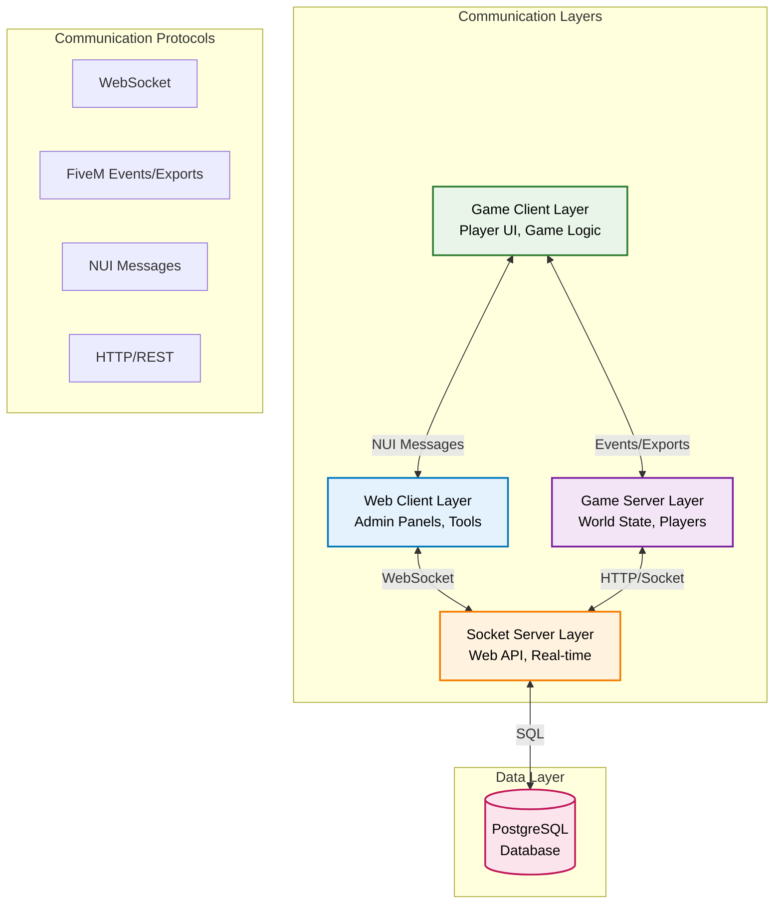
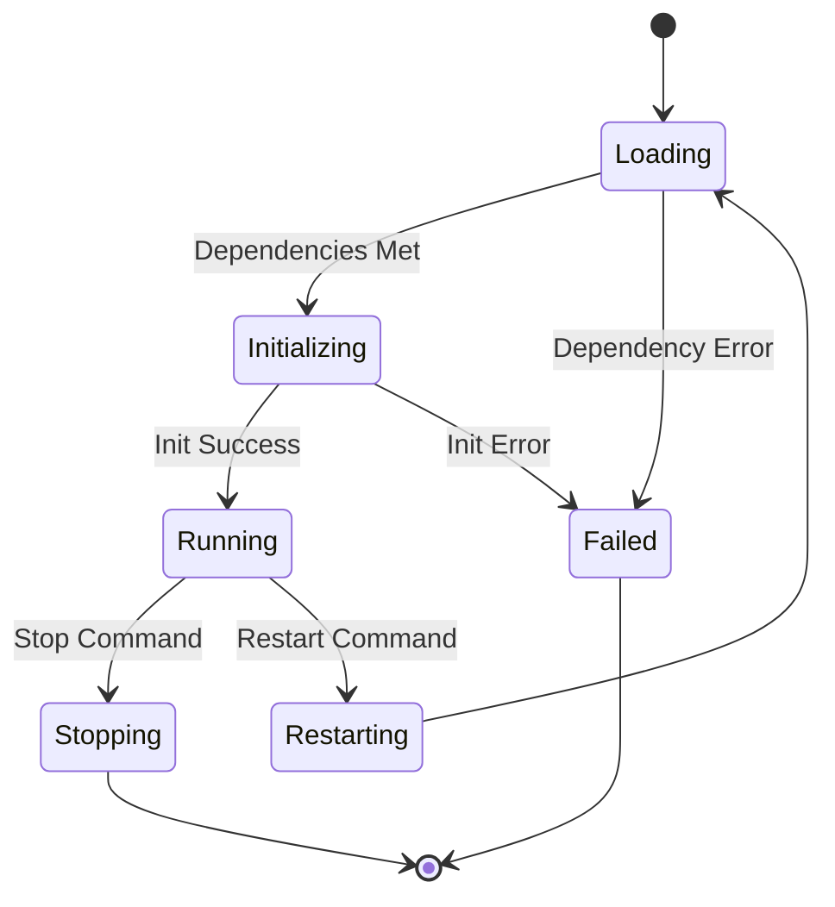
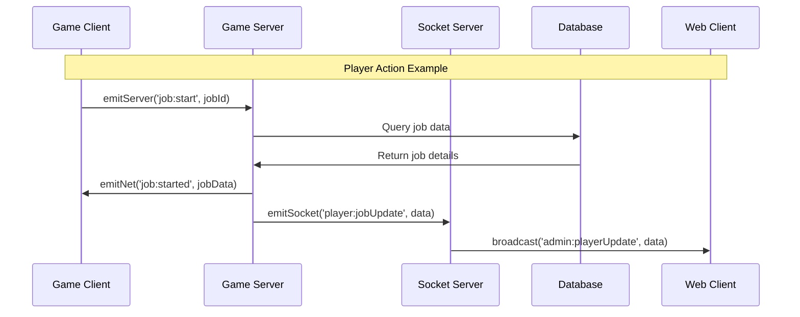
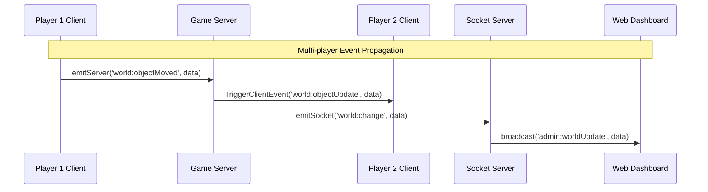
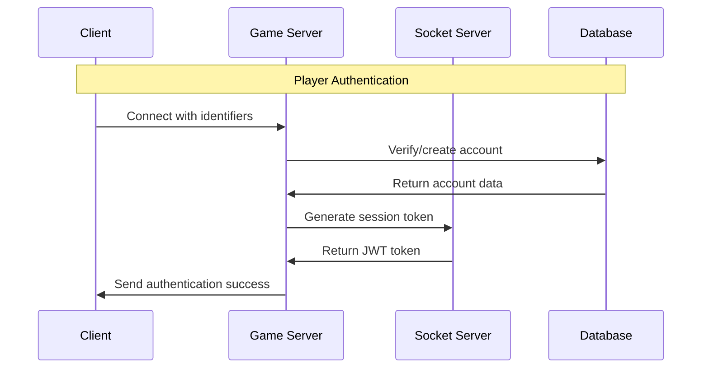
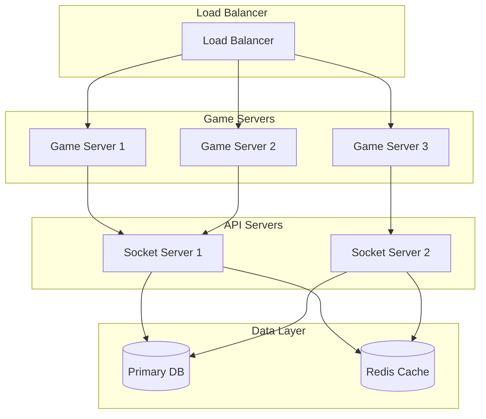
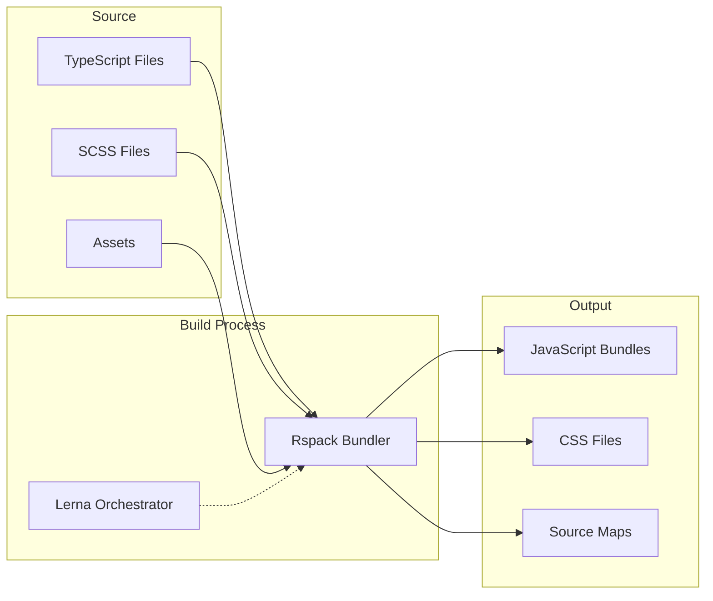

# Architecture Overview

Pioneer Village implements a sophisticated four-layer architecture designed for scalability, maintainability, and real-time performance. This overview explains the system design and how components interact.

## System Architecture Diagram



## Four-Layer Architecture

### 1. Web Client Layer
**Technology**: Browser-based applications
**Purpose**: External tools and administration

- **Admin Panels** - Server management and configuration
- **Player Tools** - Character management, statistics
- **Monitoring Dashboards** - Server health and metrics
- **Integration Tools** - Discord bots, web APIs

### 2. Game Client Layer  
**Technology**: FiveM/RedM client (Lua + TypeScript)
**Purpose**: Player interaction and game presentation

- **UI Rendering** - Preact-based UI components
- **Input Handling** - Player controls and commands
- **Game Logic** - Client-side game mechanics
- **Asset Management** - Textures, models, sounds

### 3. Game Server Layer
**Technology**: FXServer/CitizenFX (Lua + TypeScript)  
**Purpose**: Game world simulation and player management

- **World State** - Game world persistence and simulation
- **Player Management** - Sessions, characters, permissions
- **Game Mechanics** - Jobs, inventory, interactions
- **Resource Management** - Plugin lifecycle and coordination

### 4. API/Socket Server Layer
**Technology**: Node.js with Socket.IO
**Purpose**: External services and real-time communication

- **Web API** - RESTful endpoints for external tools
- **Real-time Communication** - WebSocket connections
- **Database Management** - Data persistence and queries
- **External Integrations** - Third-party service connections

## Communication Patterns

### Inter-Layer Communication

#### 1. Game Client ↔ Game Server
```typescript
// Client to Server (Events)
emitServer('player:action', { type: 'jump', force: 10 });

// Server to Client (Events) 
emitNet('player:update', source, { health: 100, stamina: 50 });

// Server Exports (Function Calls)
const playerData = global.exports.base.getPlayerData(source);
```

#### 2. Game Server ↔ Socket Server
```typescript
// HTTP Requests
const response = await fetch('http://localhost:3001/api/players', {
  method: 'POST',
  body: JSON.stringify(playerData)
});

// Socket Events
emitSocket('player:connected', { id: source, name: playerName });
```

#### 3. Web Client ↔ Socket Server
```javascript
// WebSocket Connection
const socket = io('http://localhost:3001/admin');

// Real-time Events
socket.emit('admin:getPlayers');
socket.on('admin:playersUpdate', (players) => {
  updatePlayerList(players);
});
```

#### 4. Game Client ↔ UI
```typescript
// Client to UI (NUI)
emitUI('inventory:open', { items: playerItems });

// UI to Client (Callbacks)
onUI('inventory:useItem', (itemId: string) => {
  // Handle item usage
});

// RPC Pattern (Promise-based)
const result = await awaitUI('dialog:confirm', { 
  message: 'Are you sure?' 
});
```

## Resource System Architecture

### Resource Lifecycle



### Resource Types

#### Core Resources (`[core]/`)
Essential system functionality that other resources depend on:

- **`init`** - Resource initialization management
- **`base`** - Foundation utilities and player management  
- **`ui`** - User interface system and communication
- **`events`** - Event management and coordination
- **`doors`** - World interaction system

#### System Resources (`[system]/`)
Framework-level resources that provide infrastructure:

- **`rdr3-shared`** - Game data and native definitions
- **`sessionmanager-rdr3`** - Player session management

#### Feature Resources
Game functionality and content:

- **`health`** - Player health and survival mechanics
- **`inventory`** - Item management system
- **`jobs`** - Employment and task system
- **`fishing`** - Fishing mini-game and mechanics
- **`stable`** - Horse management system

#### Tool Resources (`[tools]/`)
Development and administration utilities:

- **`dev`** - Developer commands and debugging
- **`object_manager`** - World object placement tools
- **`tracking`** - Performance monitoring and logging

## Data Flow Architecture

### Request-Response Pattern



### Event-Driven Updates



## Type System Architecture

### Namespace Organization

Pioneer Village uses TypeScript namespaces to organize types by domain:

```typescript
// Global game types
declare namespace Game {
  interface Player {
    source: number;
    name: string;
    character?: Character;
  }
  
  interface Character {
    id: string;
    firstName: string;
    lastName: string;
    // ...
  }
}

// Resource-specific types
declare namespace Inventory {
  interface Item {
    id: string;
    name: string;
    quantity: number;
    metadata?: Record<string, any>;
  }
  
  interface Events {
    'inventory:useItem': (itemId: string) => void;
    'inventory:updateSlot': (slot: number, item: Item) => void;
  }
}
```

### Library Type Exports

```typescript
// Client library types
declare namespace ClientExports {
  interface UI {
    emitUI: (event: string, data?: any) => void;
    awaitUI: <T>(event: string, data?: any) => Promise<T>;
    focusUI: (layer: string, focus: boolean) => void;
  }
  
  interface Server {
    emitServer: (event: string, data?: any) => void;
  }
}

// Server library types  
declare namespace ServerExports {
  interface Socket {
    emitSocket: (event: string, data?: any) => void;
  }
  
  interface Client {
    emitNet: (event: string, target: number, data?: any) => void;
  }
}
```

## Security Architecture

### Authentication Flow



### Permission System

```typescript
// Role-based permissions
interface Permission {
  resource: string;
  action: string;
  granted: boolean;
}

interface Role {
  id: string;
  name: string;
  permissions: Permission[];
}

interface Player {
  roles: Role[];
  hasPermission(resource: string, action: string): boolean;
}
```

## Performance Architecture

### Optimization Strategies

#### 1. **Resource Bundling**
- Rspack for efficient module bundling
- Code splitting by resource
- Tree shaking for unused code elimination

#### 2. **Communication Optimization**
- Event batching for bulk operations
- Debounced updates for high-frequency events
- Connection pooling for database access

#### 3. **Memory Management**
- Resource isolation prevents memory leaks
- Automatic cleanup on resource restart
- Efficient data structures for game state

#### 4. **Network Optimization**
- Compressed data transmission
- Event prioritization by importance
- Rate limiting for abuse prevention

## Scalability Considerations

### Horizontal Scaling



### Resource Distribution

Resources can be distributed across servers based on functionality:

- **Core Server** - Essential resources (base, ui, init)
- **Feature Servers** - Game mechanics (jobs, inventory, health)
- **Utility Servers** - Tools and admin resources

## Development Architecture

### Build System Flow



### Development Workflow

1. **Write TypeScript** - Full type safety and IntelliSense
2. **Rspack Builds** - Fast compilation and bundling  
3. **Hot Reload** - Instant feedback without restart
4. **Resource Restart** - Automatic resource reloading
5. **Test & Debug** - Comprehensive debugging tools

## Next Steps

Now that you understand the architecture:

1. **[Development Environment](../development/environment-setup.md)** - Set up your tools
2. **[Core Systems](../core-systems/)** - Deep dive into system components
3. **[Resource Development](../resource-development/)** - Build your own resources
4. **[API Reference](../api-reference/)** - Complete function documentation

---

*Understanding the architecture is key to building maintainable and scalable resources in Pioneer Village.*
